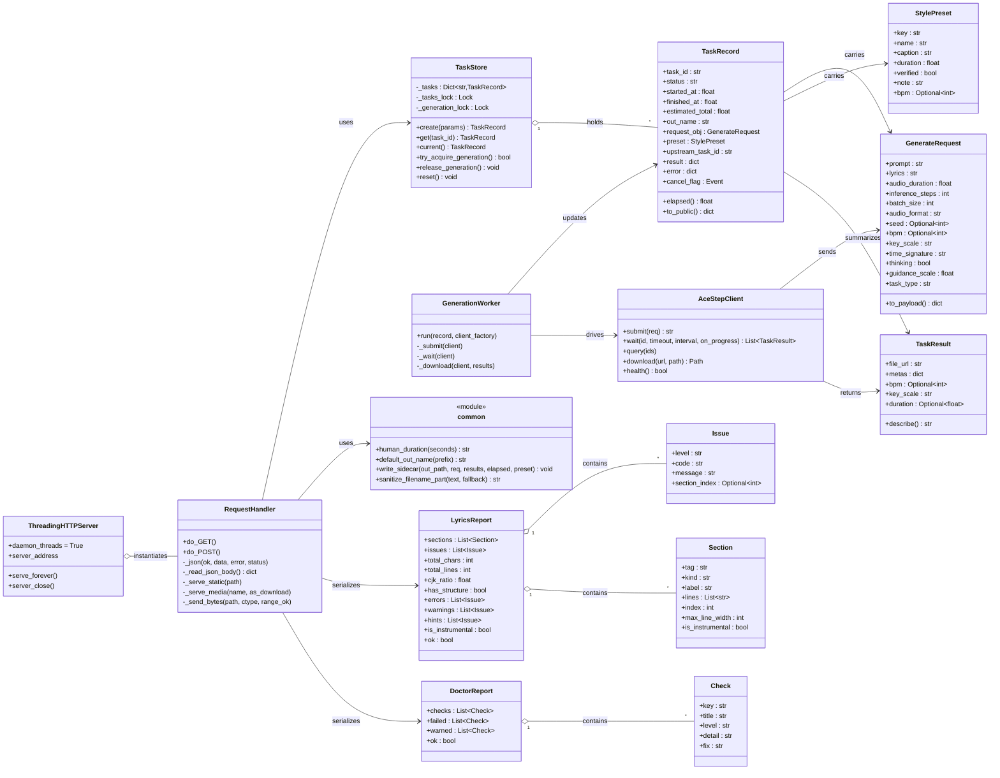
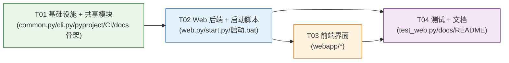

# ARCH：song-for-someone 图形界面版（Web UI 化）系统架构设计

> 输入：`docs/design/PRD-web-ui.md`（增量 PRD）、现有代码（`song_for_someone/*`、`tools/*`、`tests/*`、`pyproject.toml`、`README.md`、`docs/03-常见问题.md`）。
> 定位：给工程师的**可照着写代码**的任务书。所有红线（零依赖 / 无构建 / 57 测试全绿 / 只绑 127.0.0.1）在本文中逐条落到接口与调用链上。
> 更新日期：随 `0.2.0` 版本发布。

---

## 0. 一页纸总览

新增一个**同进程内的本地 Web 服务**（Python 标准库 `http.server`），把现有 6 个能力中「普通人真正要用」的 5 件事搬到浏览器里（`doctor`→环境页、`check`→歌词实时体检、`styles`→风格下拉、`make`→主表单 + 诚实进度条 + 播放下载、`songs`→我的作品）。界面为**手写 HTML/CSS/JS**，无构建、无框架、无第三方依赖。

关键技术难点只有一个：**上游 ACE-Step 只有三态轮询（0/1/2），没有真实百分比，且 5 秒才更新一次**。解决方式是把「已耗时」透出给前端，由**前端 200ms 本地插值**驱动进度条，条子封顶 90%，超时切换为流动条纹——估算、但不伪装成真实进度。

一个决定全局结构的选择：**生成任务跑在后台工作线程里，HTTP 请求立即返回**（`202 + task_id`），前端通过轮询 `GET /api/task/<id>` 取状态。这同时解决了「长耗时阻塞」「服务保持可响应」「单任务锁」「第二请求明确拒绝」四个问题。

---

# Part A：系统设计

## 1. 实现方案与框架选型

### 1.1 核心难点与对策

| 难点 | 为什么难 | 本设计对策 |
|---|---|---|
| **长耗时阻塞** | `AceStepClient.wait()` 是阻塞调用，最长 1800s。若在请求线程里同步跑，整个服务会被占死（静态资源、`/health`、进度查询全部排队） | 请求只做「校验 + 抢锁 + 建记录 + 起线程」，立即返回 `202`；真正的工作在 **daemon 工作线程**里跑 |
| **服务端状态 5s 才更新** | `on_progress` 最快 5s 回调一次，条子会一跳一跳 | **服务端只透出 `elapsed`（每次轮询实时由 `now-started_at` 算），前端用 ~200ms 定时器本地插值** |
| **单任务锁** | 16GB 显存跑不了两个生成 | 进程内 `threading.Lock`；`acquire(blocking=False)` 失败即返回 `409 busy`，**明确拒绝而非静默排队** |
| **端口占用** | 普通人不会改端口 | 启动时从 8770 起顺延试探，绑定成功才继续，并把**实际端口大写打印到终端** |
| **不能把 traceback 递给用户** | 上游 `ServiceUnreachable`/`AceStepError` 是英文异常 | 所有异常在 Web 层收敛成 `{code, message, fix}`，界面只渲染中文人话 |
| **静态资源路径** | `pip install` 后 `webapp/` 不一定被打包 | 读取 `Path(__file__).parent/"webapp"`；`pyproject.toml` 加 `package-data`（见 §6）；且 `web.py` 内置**极小兜底页**，资源缺失也能起 |
| **测试不能碰 GPU** | 57 个现存测试零依赖、不联网 | `web.py` 暴露**可注入的客户端工厂**与目录常量，测试用假客户端 + 临时目录（见 §5/T04） |

### 1.2 为什么是 `ThreadingHTTPServer` 而不是 `HTTPServer`

**必须用 `http.server.ThreadingHTTPServer`。理由：**

- 生成任务最长 1800s。虽然生成跑在独立工作线程，但**请求处理本身也包含可能阻塞的调用**（如 `/api/doctor` 里 `run_doctor()` 会调 `nvidia-smi`（≤15s）和 `diffusers` 子进程导入（≤180s）；`/api/env` 要连上游 `/health`）。用单线程的 `HTTPServer`，一次 `/api/doctor` 就会把「歌词体检」「进度轮询」「静态资源」全部堵住至少十几秒。
- `ThreadingHTTPServer` 每个连接一个线程，天然支持「下载音频」「轮询进度」「拉静态资源」并发。线程数在本工具的量级（单人本机）完全无压力。

**代价与约束**（必须遵守，否则会踩坑）：

- 服务器实例设 `daemon_threads = True`；所有工作线程 `daemon=True`。这样 **Ctrl+C / 关窗口后不留孤儿进程**（P0-1 判据③）——主线程退出即进程退出。
- 共享状态（`TaskStore`）必须**自己在多线程下加锁**，不能假设单线程。

### 1.3 选用的标准库模块（全部内置，零依赖）

| 模块 | 用途 |
|---|---|
| `http.server`（`ThreadingHTTPServer`、`BaseHTTPRequestHandler`、`SimpleHTTPRequestHandler`） | HTTP 服务与静态文件 |
| `json` | 所有 API 的序列化 |
| `threading` | 工作线程、全局生成锁、`Event` 取消标志 |
| `socket` | 端口探测、`/api/env` 的服务可达性快查 |
| `webbrowser` | 就绪后自动打开浏览器（Q2） |
| `uuid` | `task_id` |
| `time` / `datetime` | 已耗时、时间戳、文件名时间戳 |
| `secrets` | （可选）若需随机前缀 |
| `functools` | 给 handler 注入静态目录 |
| `urllib.parse` | 查询串解析、`Content-Disposition` 的 UTF-8 文件名编码 |
| `mimetypes` | 按扩展名给音频/静态资源设 `Content-Type` |
| `pathlib` / `os` / `sys` / `argparse` / `re` | 路径、参数、文本处理（`re` 用于文件名消毒） |

### 1.4 架构分层与依赖方向（禁止反向依赖）

```
      ┌───────────────────────────────────────────────┐
      │  webapp/  (index.html / app.js / style.css)    │  纯静态，只认 HTTP API
      └───────────────┬───────────────────────────────┘
                      │ fetch JSON
      ┌───────────────▼───────────────────────────────┐
      │  web.py   （HTTP 路由 + 任务状态 + 工作线程）   │  ← 只依赖标准库 + 下方各模块
      └───┬───────────┬─────────────┬─────────────┬────┘
          │           │             │             │
      client.py   lyrics.py    doctor.py     styles.py         （现有，不改）
          │
       common.py  ←  cli.py 与 web.py 共用（human_duration / default_out_name / write_sidecar / sanitize_filename_part）
          ▲
       cli.py （现有，仅改 import 结构为 `from .common import ...`，对外行为不变）
```

**依赖铁律**：`web.py` 直接 `import` `client/lyrics/doctor/styles/common`，**绝不 `import cli`**。`common.py` 不 import 包内任何模块（除 `client`/`styles` 仅用于类型标注）。这样 Web 层不会反向依赖 CLI 层（Q5 的初衷）。

---

## 2. 文件列表

新增标 `+`，修改标 `~`。相对路径以仓库根为基准。

### 2.1 包内代码

| 路径 | 状态 | 职责（一句话） |
|---|---|---|
| `song_for_someone/common.py` | `+` | 公共工具：`human_duration`、`default_out_name(prefix)`、`write_sidecar(...)`、`sanitize_filename_part(...)`、共享常量（默认输出目录名等）。`cli.py` 与 `web.py` 共用。 |
| `song_for_someone/cli.py` | `~` | 仅把三个工具函数的**定义**改为 `from .common import ...`（保持 `cli.default_out_name` 等仍可 import，对外行为逐字不变）。 |
| `song_for_someone/web.py` | `+` | 标准库 HTTP 服务：路由、JSON 接口、内存任务状态、后台工作线程、单任务锁、端口顺延、就绪后开浏览器、静态/媒体文件服务、`main()` 入口。 |
| `song_for_someone/__init__.py` | `~` | `__version__` 由 `0.1.0` → `0.2.0`。 |
| `song_for_someone/webapp/index.html` | `+` | 单页界面骨架：四个状态（填写/生成中/完成/出错）+ 我的作品 + 环境页，含所有块的 id 锚点。 |
| `song_for_someone/webapp/app.js` | `+` | 前端状态机：接口调用、歌词防抖体检、**200ms 本地插值进度**、阶段文案、门禁二次确认、播放/下载/历史/复用。 |
| `song_for_someone/webapp/style.css` | `+` | 全部样式：进度条 + 流动条纹动画、三级问题配色、响应式基础排版。 |
| `song_for_someone/webapp/favicon.svg` | `+` | 页面图标（一个音符）。 |

### 2.2 启动入口

| 路径 | 状态 | 职责 |
|---|---|---|
| `start.py` | `+` | 跨平台双击入口：校验 Python ≥3.9 → 调 `web.main()`；异常时打印中文指引并 `input()` 停留。 |
| `启动.bat` | `+` | Windows 双击入口：`chcp 65001` → 检测 `python` → 缺失时打印**具体安装指引（含「勾选 Add Python to PATH」）** → 否则运行 `python start.py`；正常/异常退出都 `pause`。 |

### 2.3 测试与文档

| 路径 | 状态 | 职责 |
|---|---|---|
| `tests/test_web.py` | `+` | Web 层接口测试：临时端口 + 假客户端 + 临时 `songs/`，不依赖 GPU / 真实 ACE-Step。 |
| `README.md` | `~` | 增加「图形界面」入口与一键启动说明；目录树如实更新。 |
| `docs/04-图形界面使用.md` | `+` | 面向普通读者的图解说明（双击 → 填表 → 等待 → 下载）。 |
| `docs/design/ARCH-web-ui.md` | `+` | 本文。 |
| `docs/design/sequence-diagram.mermaid` | `+` | 时序图单独存档（供文档引用）。 |
| `docs/design/class-diagram.mermaid` | `+` | 类图单独存档。 |

### 2.4 项目结构规范化（Q10）

| 路径 | 状态 | 职责 |
|---|---|---|
| `CHANGELOG.md` | `+` | 记录 `0.2.0`：Web 界面、一键启动、公共模块抽取。 |
| `CONTRIBUTING.md` | `+` | 零依赖约束、跑测试、CLI 行为不变的约定（简短）。 |
| `.github/workflows/tests.yml` | `+` | CI：Python 3.9/3.10/3.11/3.12 matrix 跑 `unittest discover`（零依赖几乎零成本）。 |
| `screenshots/.gitkeep` | `+` | 界面截图占位目录（公众号文章要用）。 |
| `.gitignore` | `~` | 补充界面调试产物（如 `*.log`、临时下载）。 |
| `pyproject.toml` | `~` | `version`→`0.2.0`；`package-data` 加 `webapp/*`；`dependencies` **保持 `[]`**。 |

**与 PRD §3.4 的差异（已核对）**：PRD 的目录树把 `design/` 写了两遍（重复节点，纯文档笔误），且未列 `common.py`。本设计**新增 `common.py`**（Q5 决策）并修正目录树。另：PRD 把 `tests/test_web.py` 放在 `tests/`，一致。

---

## 3. 数据结构与接口

### 3.1 类图（Mermaid）



### 3.2 HTTP API 端点清单

**统一信封**（所有 `/api/*` 与 `/health`）：

- 成功：`{"ok": true, "data": <...>}`
- 失败：`{"ok": false, "error": {"code": "<机器可读码>", "message": "<中文人话>", "detail": "<可选，折叠区用>"}}`

> `code` 给前端做分支，`message` 给用户看（中文、可行动、无 traceback）。HTTP 状态码与 `code` 配合使用。

| # | 路径 | 方法 | 请求体 | 成功响应 `data` | 说明 |
|---|---|---|---|---|---|
| 1 | `/health` | GET | — | `{"app":"song-for-someone","version":"0.2.0"}` | **纯存活探测，不做任何上游调用，恒 200**。供启动器判断「我们的服务起没起」。 |
| 2 | `/api/meta` | GET | — | `{styles:[...],durations:[...],lyrics_max_chars:4096,examples:[{key,name}]}` | 界面首屏数据源。`styles[]` 由 `styles.list_presets()` 生成，字段 `{key,name,prompt,duration,verified,note,bpm,badge}`（`prompt` 即 `StylePreset.caption`）。 |
| 3 | `/api/env` | GET | — | `{"python_ok":bool,"service_ok":bool,"service_detail":"...","out_dir_ok":bool}` | **轻量**环境快查（socket + 短超时 `/health`），驱动首屏红/黄/绿角标。目标 ≤2s。 |
| 4 | `/api/doctor` | GET | — | `DoctorReport` 序列化（见 §3.4） | 完整自检。**可能慢（diffusers 导入 ≤180s）**，必须在工作线程执行；前端显示「检查中」。 |
| 5 | `/api/lyrics/check` | POST | `{"lyrics":"..."}` | `LyricsReport` 序列化（见 §3.4） | 纯本地计算，无网络。前端 500ms 防抖调用。 |
| 6 | `/api/generate` | POST | 见 §3.3 | `{"task_id":"...","estimated_total":15.0,"out_name":"给妈妈-song-0929-2043.mp3"}`，**HTTP 202** | 校验 → 抢锁 → 建记录 → 起线程 → 立即返回。 |
| 7 | `/api/task/<task_id>` | GET | — | `TaskRecord.to_public()`（见 §3.3） | 前端轮询状态（默认 1s）。 |
| 8 | `/api/tasks/current` | GET | — | `TaskRecord.to_public()` 或 `null` | 页面刷新后重新接上正在跑的任务。 |
| 9 | `/api/task/<task_id>/cancel` | POST | — | `{"cancelled":true}` | **尽力而为**：置取消标志，工作线程在下次 `on_progress` 抛出退出。⚠️ 不能真正中断上游任务（见 §8）。 |
| 10 | `/api/songs` | GET | — | `{songs:[{name,size_bytes,mtime,bpm,key_scale,created_at,elapsed_seconds,request:{...}\|null}]}` | P1-2「我的作品」数据源。排序按 `st_mtime` 倒序（与 `cmd_songs` 一致）。 |
| 11 | `/api/example` | GET | `?name=birthday\|lullaby` | `{"name":"birthday","text":"..."}` | P1-4 载入示例。 |
| 12 | `/`、`/index.html`、`/app.js`、`/style.css`、`/favicon.svg` | GET | — | 静态文件 | 从 `webapp/` 读取。 |
| 13 | `/media/<name>` | GET | — | 音频字节流（内联，支持 `Range`→206） | 供 `<audio>` 播放；`Content-Type` 由扩展名决定。**文件名做路径穿越校验**。 |
| 14 | `/download/<name>` | GET | — | 音频字节流 + `Content-Disposition: attachment` | 下载按钮。文件名用 `filename*=UTF-8''...` 编码（中文名）。 |

> **端点 #9 `/api/task/<task_id>/cancel`：0.2.0 版不实现**（主理人决策，见 §8 A3）。原因：释放单任务锁后用户可能立刻开新任务 → 两个生成并行 → 打爆 16GB 显存，与单任务锁的目的相矛盾；且实测一首歌仅约 15 秒，收益极低。因此本版**没有**该路由，界面上也没有「取消」按钮，改为一句提示「生成期间可以关掉页面，任务会继续跑完」。`TaskRecord.cancel_flag` 与内部异常 `_Cancelled` 作为占位保留（工作线程仍会检查该标志，为将来恢复预留），但当前没有任何入口会置位它。

### 3.3 请求 / 响应 JSON Schema

**`POST /api/generate` 请求体**

```json
{
  "prompt": "温暖的中文流行民谣，木吉他为主……",   // 必填；由风格模板带出，或用户自定义「风格描述」
  "style_key": "folk",                            // 可选；仅用于写进 sidecar 的 preset 字段
  "lyrics": "[Verse 1]\n……",                       // 必填；纯器乐传 "[Instrumental]"
  "duration": 120,                                // 秒，必填（来自时长选择或模板）
  "language": "zh",                               // 可选，默认 zh
  "seed": null,                                   // 可选
  "bpm": null,                                    // 可选
  "key_scale": "",                                // 可选
  "time_signature": "",                           // 可选
  "inference_steps": 8,                           // 可选，默认 8
  "batch_size": 1,                                // 可选，默认 1
  "audio_format": "mp3",                          // 可选，默认 mp3
  "thinking": true,                               // 可选，默认 true
  "guidance_scale": 7.0,                          // 可选，默认 7.0（界面不暴露）
  "out_prefix": "给妈妈",                          // 可选；「给谁做的」标签，做文件名前缀（Q7）
  "force": false,                                 // 歌词有 error 时是否强行生成（== CLI --force）
  "yes": false                                    // 歌词有 warn 时是否确认继续（== CLI --yes）
}
```

> **关于键名：界面前端实际发送「友好别名」**。为了让 `webapp/` 的界面源码里不出现裸术语（见 §7.3 禁用词清单），`webapp/app.js` 提交请求时使用下表的**友好键名**；**后端 `web.py` 两种键名都接受**——原始契约键名（`seed` / `inference_steps` / …）与友好别名完全等价。因此上表契约**不受影响**：直接按原始键名调用的调用方照常工作。
>
> 维护提示：下表是**唯一权威**的别名映射；`web.py::_build_request`（接收）与 `web.py::_refill_from_request`（回填）共用 `_ADVANCED_ALIASES` 常量，勿各写一份。

| 友好键名（界面发送） | 契约原始键名（`GenerateRequest` 字段） |
|---|---|
| `fixed_id` | `seed` |
| `tempo` | `bpm` |
| `tune` | `key_scale` |
| `steps` | `inference_steps` |
| `versions` | `batch_size` |
| `file_type` | `audio_format` |
| `draft_first` | `thinking` |

**`POST /api/generate` 的失败响应（关键分支）**

| HTTP | `code` | 触发条件 | `message`（中文人话） | 前端动作 |
|---|---|---|---|---|
| 400 | `bad_request` | 缺 `prompt` 或 `lyrics` 为空 | 「请先写好歌词、选好风格」 | 回到表单，聚焦缺失项 |
| 409 | `lyrics_error` | `report.errors` 且 `force=false` | 「歌词有 N 个必须改的地方，多半会唱不顺」+ `data.issues` | 弹二次确认（「我知道，还是生成」→ 带 `force:true` 重发） |
| 409 | `lyrics_warning` | 有 warn 且 `yes=false` | 「歌词有 N 处建议改的地方」 | 按钮旁出现「继续」（带 `yes:true` 重发） |
| 409 | `busy` | 生成锁已在别处持有 | 「正在生成中，等这一首出完再点」 | 禁用按钮 + 展示当前任务进度 |
| 422 | `bad_duration` | 时长非法（超范围） | 「时长请选 1 到 3 分钟之间」 | 高亮时长控件 |

**`TaskRecord.to_public()` 响应（`GET /api/task/<id>`）**

```json
{
  "ok": true,
  "data": {
    "task_id": "8f3c…",
    "status": "queued | running | done | failed | timeout | cancelled",
    "phase":  "queued | submitting | running | finalizing | done | failed",
    "started_at": 1730000000.123,
    "elapsed": 12.4,                       // 服务端「现在」实时计算，非缓存
    "estimated_total": 15.0,               // 服务端算好的预估值（前端只用它做分母）
    "upstream_task_id": "b2190d64-…",       // 供展开区显示
    "out_name": "给妈妈-song-0929-2043.mp3",
    "result": {                            // status=done 时才有，否则 null
      "files": [
        {"name": "给妈妈-song-0929-2043.mp3", "size_bytes": 2202009, "media_url": "/media/给妈妈-song-0929-2043.mp3", "download_url": "/download/给妈妈-song-0929-2043.mp3"}
      ],
      "duration": 121.0,                   // seconds；取不到则省略该键
      "bpm": 77,
      "key_scale": "D major",
      "reproduce": "sfs make --caption \"…\" --lyrics-file <歌词文件> --duration 120",
      "params": { /* 原样 request payload，折叠区用 */ }
    },
    "error": null                          // status=failed/timeout 时才非空
  }
}
```

**`error` 对象（status=failed / timeout）**

```json
{ "code": "service_unreachable | submit_failed | generate_failed | download_failed | timeout",
  "message": "中文人话", "detail": "服务端原始返回（折叠区）" }
```

### 3.4 复用模块的 JSON 序列化（在 `web.py` 里定义，不改动 `cli.py` 的 `--json` 输出）

**`LyricsReport` → dict**（新增 `label`、`is_instrumental` 供界面结构条用；`cmd_check --json` 的形状**保持原样不动**）：

```json
{
  "total_chars": 209, "total_lines": 23, "cjk_ratio": 0.81,
  "has_structure": true, "ok": true, "is_instrumental": false,
  "sections": [{"index":0,"tag":"Verse 1","kind":"verse","label":"主歌","lines":4,"max_line_width":22,"is_instrumental":false}],
  "issues":   [{"level":"warn","code":"no-chorus","message":"……","section_index":null}]
}
```

**`DoctorReport` → dict**：

```json
{
  "ok": true, "warned": true, "failed": 0,
  "checks": [{"key":"gpu","title":"显卡","level":"warn","level_label":"注意","detail":"……","fix":"……","extra":[]}]
}
```

`level_label` 用 `doctor.LEVEL_LABELS`（`ok`→`OK` 会显示成 `OK`；界面把 `ok`/`warn`/`fail`/`skip` 映射为绿/黄/红/灰四色，文字用「正常/注意/失败/跳过」，**skip 不是红色**）。

### 3.5 内存任务状态的数据结构（`TaskStore`）

```python
# web.py
@dataclass
class TaskRecord:
    task_id: str                       # uuid4().hex
    status: str = "queued"             # queued|running|done|failed|timeout|cancelled
    phase: str = "queued"
    created_at: float = 0.0
    started_at: float = 0.0            # 提交那一刻
    finished_at: float = 0.0
    estimated_total: float = 15.0
    out_name: str = ""                 # 消毒+前缀后的最终文件名（含扩展名）
    out_path: Optional[Path] = None
    request_obj: Optional[GenerateRequest] = None
    request_payload: dict = field(default_factory=dict)
    preset: Optional[StylePreset] = None
    upstream_task_id: Optional[str] = None
    result: Optional[dict] = None
    error: Optional[dict] = None
    cancel_flag: threading.Event = field(default_factory=threading.Event)

    def elapsed(self) -> float:
        if self.status in ("done", "failed", "timeout", "cancelled") and self.finished_at:
            return self.finished_at - self.started_at
        return max(0.0, time.time() - self.started_at)
```

`TaskStore` 用一个模块级实例：

- `_tasks: Dict[str, TaskRecord]`，读写下加 `_tasks_lock`。
- `_generation_lock: threading.Lock`（进程级，**全局单任务锁**）。
- `try_acquire_generation()` = `self._generation_lock.acquire(blocking=False)`。
- `current()` 返回第一个 `status in ("queued","running")` 的记录。
- `reset()` 供测试清空（见 T04）。

### 3.6 预估值与阶段映射（服务端算预估，前端算插值）

**服务端**（`web.py::estimate_seconds`，常量集中在文件顶部便于调参）：

```python
BASE_SECONDS = 15.0          # 预热后 2 分钟歌约 15 秒（README 实测）
COLD_MULTIPLIER = 2.0        # 本次会话首首 ×2（覆盖模型加载；实测首首 30.7s）
MIN_ESTIMATE = 8.0
def estimate_seconds(duration, batch_size, session_has_success) -> float:
    base = BASE_SECONDS * (duration / 120.0) * max(1, batch_size)
    if not session_has_success:
        base *= COLD_MULTIPLIER
    return max(MIN_ESTIMATE, base)
```

`session_has_success` 由 `TaskStore` 记一个「本进程是否成功出过至少一首」的布尔。

**阶段映射（前端定义，纯展示）**：

| `ratio = elapsed/estimated_total` | 主文案 | 副文案 | 条子 |
|---|---|---|---|
| 0 – 0.15 | 正在把你的歌词交给模型 | 已经等了 {n} 秒 | 0–15% 平滑 |
| 0.15 – 0.40 | 正在理解歌词，安排段落 | 估计还要 {x} 秒左右 | 15–40% |
| 0.40 – 0.75 | 正在编曲 | 估计还要 {x} 秒左右 | 40–75% |
| 0.75 – 1.0 | 正在演唱 | 估计还要 {x} 秒左右 | 75–**90%**（封顶） |
| ratio > 1.0 | 还在唱，比平时久一些 | 已经等了 {n} 秒，还在等 | **流动条纹，无百分比、无剩余时间** |
| 完成 | 好了，出歌用了 {n} 秒 | — | 一次性走满 100% |

`{x} = max(3, round(estimated_total - elapsed))`，`{n} = round(elapsed)`。**条子只允许 90% 封顶，绝不显示数字刻度。**

---

## 4. 程序调用流程

### 4.1 时序图 · 正常路径（提交 → 轮询 → 完成 → 下载）

```mermaid
sequenceDiagram
    autonumber
    participant U as 用户
    participant UI as app.js（界面）
    participant W as web.py
    participant ST as TaskStore
    participant G as GenerationWorker(线程)
    participant K as AceStepClient
    participant S as ACE-Step 服务(8001)
    participant FS as songs/

    Note over W: 启动：绑定 127.0.0.1:8770(占用则顺延)→打印实际端口→就绪后 webbrowser.open
    U->>UI: 双击 启动.bat → 浏览器自动打开
    UI->>W: GET /api/meta
    W-->>UI: 10 个风格模板 + 时长选项 + 上限
    UI->>W: GET /api/env
    W->>S: socket 连接 + /health（≤2s）
    W-->>UI: {service_ok:true}（右上角「环境 正常」）

    loop 输入过程中（防抖 500ms）
        UI->>W: POST /api/lyrics/check {lyrics}
        W->>W: lyrics.analyze(text)
        W-->>UI: LyricsReport（分级渲染 + 结构条）
    end

    U->>UI: 点「开始出歌」
    UI->>W: POST /api/generate {prompt, lyrics, duration, out_prefix,…}
    W->>W: lyrics.analyze → 无 error/warn 通过门禁
    W->>ST: try_acquire_generation()
    alt 锁可用
        ST-->>W: True
        W->>ST: create(TaskRecord, status=queued, estimated_total=…)
        W->>G: thread.run(record)（daemon）
        W-->>UI: 202 {task_id, estimated_total, out_name}
    else 已被占用
        ST-->>W: False
        W-->>UI: 409 {code:"busy"}
    end

    G->>ST: record.status=running, started_at=now
    G->>K: submit(request)
    K->>S: POST /release_task
    S-->>K: {data:{task_id}}
    K-->>G: upstream_task_id
    G->>ST: record.upstream_task_id=…

    loop 前端 1s 轮询 / 前端内部 200ms 插值
        UI->>W: GET /api/task/{id}
        W->>ST: get(id) → elapsed=now-started_at
        ST-->>W: record
        W-->>UI: {status:running, elapsed, estimated_total}
        Note over UI: 200ms 定时器本地插值 → 平滑推进，封顶 90%
    end

    loop 服务端每 5s 一次（AceStepClient.wait interval=5.0）
        K->>S: POST /query_result
        S-->>K: status=0（生成中）
        K->>ST: on_progress(elapsed, 0)  更新心跳；检查 cancel_flag
    end

    S-->>K: status=1 + result[{file,metas}]
    K-->>G: [TaskResult,…]
    G->>ST: record.phase=finalizing
    loop 每个结果（batch）
        G->>K: download(file_url, out_path)
        K->>S: GET /v1/audio?…
        S-->>K: 音频字节
        K->>FS: 写 <out_name>（+ _i 后缀当 batch>1）
    end
    G->>FS: common.write_sidecar(out_path, req, results, elapsed, preset)
    G->>ST: record.status=done, result={files,duration,bpm,key_scale,reproduce,params}
    ST->>ST: release_generation(); session_has_success=True

    UI->>W: GET /api/task/{id} → {status:done, result}
    UI->>W: GET /media/<out_name>  (Range) → 音频流
    W-->>UI: 206 音频字节 → <audio> 播放
    U->>UI: 点「下载到电脑」
    UI->>W: GET /download/<out_name>
    W-->>U: 附件下载（Content-Disposition, UTF-8 文件名）
```

### 4.2 时序图 · 环境异常路径（服务不可达 / 生成失败 / 超时）

```mermaid
sequenceDiagram
    autonumber
    participant U as 用户
    participant UI as app.js
    participant W as web.py
    participant G as GenerationWorker
    participant K as AceStepClient
    participant S as ACE-Step 服务

    U->>UI: 点「开始出歌」（或首屏 /api/env 已判不可达）
    UI->>W: POST /api/generate
    W->>G: 起线程（已抢到锁）
    W-->>UI: 202 {task_id}
    G->>K: submit(request)
    K--x S: 连接失败
    K-->>G: raise ServiceUnreachable("连不上 http://127.0.0.1:8001")
    G->>G: record.status=failed; error={code:service_unreachable, message:中文指引}
    G->>G: release_generation()

    UI->>W: GET /api/task/{id} → {status:failed, error:{code:service_unreachable}}
    UI-->>U: 切到「环境异常」页：三步指引（找到 ACE-Step → 双击 start_api_server.bat → 回来重试）
    U->>UI: 点「查看完整环境自检」
    UI->>W: GET /api/doctor
    W->>W: run_doctor()（工作线程，可能慢）
    W-->>UI: DoctorReport → 渲染每项 title/level_label/detail/fix（skip 显示「跳过」）

    Note over G,S: —— 其它失败分支 ——
    alt 提交成功但生成失败（status=2）
        S-->>K: status=2
        K-->>G: raise AceStepError("生成失败：…")
        G->>G: status=failed; error.code=generate_failed
        UI-->>U: 「这次没生成出来」+ 错误详情（折叠）+「再来一次」
    else 等待超时（1800s）
        G->>G: status=timeout; error.code=timeout
        UI-->>U: 「等太久了，已停止等待」+ 指向环境自检
    else 下载失败
        G->>G: status=failed; error.code=download_failed
    end
```

### 4.3 启动与端口顺延流程（P0-1）

```text
start.py / 启动.bat
  │
  ├─ 检测 Python（<3.9 或缺失）
  │     └─ 打印中文指引（含下载链接 + 「安装时勾选 Add Python to PATH」）→ 结束（不自动安装，Q1）
  │
  └─ 调用 web.main(host="127.0.0.1", base_port=8770)
        │
        ├─ for port in 8770..8799:
        │     ├─ 先 socket.create_connection(("127.0.0.1", port), 0.3)
        │     │     成功 → 端口被占，试下一个
        │     └─ 尝试 bind；OSError → 试下一个；成功 → 选中
        │
        ├─ 若 30 个端口都失败 → 打印中文指引并退出（不报 traceback）
        │
        ├─ 启动就绪探测线程：
        │     循环 GET http://127.0.0.1:<port>/health 直到 200（或超时）
        │     → webbrowser.open(f"http://127.0.0.1:{port}/")   （Q2，就绪后才开）
        │
        ├─ 大字横幅打印：
        │     「界面已启动：http://127.0.0.1:8770  （关掉这个窗口即停止）」
        │
        └─ server.serve_forever()   ← 主线程
              Ctrl+C / 关窗口 → 主线程退出 → daemon 线程随进程结束（不留孤儿进程）
```

---

# Part B：任务分解

## 5. 任务列表（按依赖排序，≤5 个）

> 完成判据里的命令（Windows PowerShell / cmd 均可，用 `python` 而非 `py`）。
> **每个任务的通用 DoD**：① `python -m unittest discover -s tests -t .` 全绿；② `pyproject.toml` 的 `dependencies` 仍为 `[]`；③ 新增文件零第三方 import；④ 6 个 CLI 子命令输出不变（唯一例外见 T01）。

---

### T01 · 项目基础设施 + 共享模块抽取 + 结构规范化 　`P0`（无依赖）

**改哪个文件、加什么：**

1. **新建 `song_for_someone/common.py`**，把 `cli.py` 里的三个函数**原样搬过来**（逻辑一字不改），并新增文件名消毒：
   - `human_duration(seconds) -> str`（照搬）。
   - `default_out_name(prefix: str = "") -> str`：`stamp = datetime.now().strftime("%m%d-%H%M")`；`prefix = sanitize_filename_part(prefix)`；有前缀返回 `f"{prefix}-song-{stamp}"`，否则返回 `f"song-{stamp}"`（**无参调用必须与现状逐字一致**）。
   - `sanitize_filename_part(text: str, fallback: str = "") -> str`：① 去首尾空白；② 删除控制字符 `[\x00-\x1f\x7f]`；③ 把 `\ / : * ? " < > |` 替换为 `_`；④ 折叠连续空白；⑤ 去掉首尾的 `.` 与空格；⑥ **截断到 ≤32 个字符**（保留中文）；⑦ 结果为空则返回 `fallback`；⑧（加固）命中 Windows 保留名（`CON/PRN/AUX/NUL/COM1-9/LPT1-9`，大小写不敏感）时前置 `_`。
   - `write_sidecar(out_path, request, results, elapsed, preset)`（照搬，含 `reproduce` 字段与 `OSError` 吞掉）。
   - 顶部集中共享常量：`DEFAULT_OUT_DIR = "songs"`（与 `cli.py` 同名同值）。
   - 允许 `from .client import GenerateRequest` 与 `from .styles import StylePreset`（仅类型标注，无循环）。
2. **改 `song_for_someone/cli.py`**：删除上述三个函数的定义，改为 `from .common import default_out_name, human_duration, write_sidecar`（这样 `cli.default_out_name` 仍可被 import，向后兼容）。其余代码**不动**。
3. **改 `song_for_someone/__init__.py`**：`__version__ = "0.2.0"`。
4. **改 `pyproject.toml`**：`version = "0.2.0"`；`dependencies = []` **保持不变**；`[tool.setuptools.package-data]` 里给 `song_for_someone` 追加 `"webapp/*"`。
5. **新建 `.github/workflows/tests.yml`**：matrix `3.9/3.10/3.11/3.12`，步骤 `actions/setup-python` → `python -m unittest discover -s tests -t .`（不装任何依赖）。
6. **新建 `CHANGELOG.md`**（首条 `0.2.0`）、**`CONTRIBUTING.md`**（零依赖 / 跑测试 / CLI 行为不变三条约定）、**`screenshots/.gitkeep`**。
7. **改 `.gitignore`**：补 `*.log` 与临时下载产物。

**完成判据：**
- `python -m unittest discover -s tests -t .` → **57 passed**（不多不少）。
- `python -m song_for_someone doctor` 与改动前输出**逐字一致**；`check/styles/style/make/songs` 同。
- `python -c "from song_for_someone.common import default_out_name, write_sidecar, human_duration, sanitize_filename_part; print(default_out_name())"` → 打印 `song-MMDD-HHMM` 形式。
- `python -c "from song_for_someone.common import sanitize_filename_part as s; print(s('a/b:c*?\"<>|'))"` → 无非法字符。
- `python -m song_for_someone --version` → 打印 `sfs 0.2.0`（**这是唯一允许变化的 CLI 可见输出**，因 PRD 要求版本 0.1.0→0.2.0）。
- `grep dependencies pyproject.toml` → `dependencies = []`。

---

### T02 · Web 后端服务 + 一键启动脚本 　`P0`（依赖 T01）

**改哪个文件、加什么：**

1. **新建 `song_for_someone/web.py`**（核心，按下面结构实现）：
   - **常量**：`HOST = "127.0.0.1"`、`DEFAULT_PORT = 8770`、`PORT_RANGE = 30`、`DEFAULT_BASE_URL = client.DEFAULT_BASE_URL`、`EST_*` 常量、`WEBAPP_DIR = Path(__file__).parent / "webapp"`、`SONGS_DIR = Path(__file__).resolve().parent.parent / "songs"`（模块级，**测试可 monkeypatch**）。
   - **可注入点**（测试要用，务必做成模块级变量）：`_client_factory = lambda base_url, timeout: AceStepClient(base_url, timeout=timeout)`；`_doctor_runner = run_doctor`；`store = TaskStore()`。
   - **`TaskStore` + `TaskRecord`**（见 §3.5）：`_generation_lock`、`try_acquire_generation()`、`release_generation()`、`create()`、`get()`、`current()`、`reset()`、`session_has_success` 标志。
   - **`GenerationWorker`**：`run(record)` = 抢锁→`status=running, started_at=now`→`submit`→`wait`（`on_progress` 更新心跳 + 检查 `cancel_flag`，被取消则抛内部异常）→ 逐个 `download`（batch>1 用 `<stem>_<i><suffix>`）→ `common.write_sidecar` → `status=done`；`finally` 释放锁、写 `finished_at`。异常按 §3.3/§4.2 映射成 `error.code`。
   - **`RequestHandler(BaseHTTPRequestHandler)`**（`directory` 由 `functools.partial` 注入 `WEBAPP_DIR`）：
     - `do_GET` / `do_POST` 路由表严格按 §3.2。
     - `_json(ok, data=None, error=None, status=200)` 统一信封；`_read_json_body()` 安全解析（非法 JSON → 400 `bad_request`）。
     - `_serve_static(path)`：从 `WEBAPP_DIR` 读；命中目录/缺失 → 404（JSON 或纯文本，不抛 traceback）。
     - `_serve_media(name, as_download)`：路径穿越校验（`name` 里含 `/`、`\`、`..` 一律 403）；支持 `Range`（→206）；`/download/` 加 `Content-Disposition: attachment; filename*=UTF-8''<quote(name)>`。
     - **兜底**：`WEBAPP_DIR` 不存在时，`GET /` 返回内置的极小 HTML（「界面资源缺失，请确认 webapp/ 目录完整」+ `/health` 信息），保证 T02 阶段服务可独立跑。
     - `log_message` 关掉或降噪（别把每条轮询刷屏）。
   - **`_serve()` / `main(argv=None)`**：端口顺延（§4.3）→ 打印实际端口横幅 → 起就绪探测线程开浏览器（`--no-browser` 可关，Q2 兜底）→ `serve_forever()`。`ThreadingHTTPServer` 子类设 `daemon_threads = True`；Ctrl+C / `KeyboardInterrupt` 时 `server_close()` 干净退出。
     - `main` 参数：`--port`（默认 8770）、`--base-url`（默认 `http://127.0.0.1:8001`）、`--out-dir`、`--no-browser`。
   - **`run_doctor` 端点必须在工作线程执行**（用 `threading.Thread` 包一层，避免 180s 阻塞请求线程）。
   - **`estimate_seconds(duration, batch_size, session_has_success)`**（§3.6）。
2. **新建 `start.py`**（跨平台双击入口）：校验 `sys.version_info >= (3,9)`；调用 `song_for_someone.web.main()`；捕获 `Exception` → 打印中文「启动失败，请把下面这段发给我」+ 关闭前 `input("按回车键关闭…")`。
3. **新建 `启动.bat`**（Windows 双击入口）：
   - 首行 `@echo off` + `chcp 65001 >nul`；
   - `where python >nul 2>nul` 失败 → `echo` 中文安装指引（含 `https://www.python.org/downloads/` 与「安装时务必勾选 Add Python to PATH」）→ `pause` → 退出；**不 pip install 任何东西**（Q1）；
   - 否则 `python "%~dp0start.py"`；结束后 `pause`（让错误可见）。

**完成判据：**
- `python -m song_for_someone.web --no-browser` 启动后，终端打印形如「界面已启动：http://127.0.0.1:8770」。
- `curl http://127.0.0.1:8770/health` → 200 `{"ok":true,...}`。
- `curl http://127.0.0.1:8770/api/meta` → `data.styles` 长度为 **10**。
- 用假客户端（临时把 `_client_factory` 指向桩）跑通：`POST /api/generate` 返回 **202** + `task_id`；随后 `GET /api/task/<id>` 最终 `status=done` 且 `result.files[0].name` 已落盘到 `songs/`。
- **并发**：连续两次 `POST /api/generate`，第二次立即返回 **409 `busy`**（不是等待、不是 500）。
- 不启动 ACE-Step 时，`POST /api/generate` 最终 `status=failed`、`error.code=service_unreachable`，界面拿到中文指引（无 traceback 文本）。
- 歌词有 error 且有 warn 时分别返回 409 `lyrics_error` / `lyrics_warning`；`force=true`/`yes=true` 时可通过（与 CLI 语义一致）。
- `python -c "import song_for_someone.web"` 不报错；整个文件的 import **无第三方**。
- 端口占用测试：先占用 8770，再启动，应自动用 8771 并打印。

---

### T03 · 前端界面与静态资源 　`P0`（依赖 T02）

**改哪个文件、加什么：**

1. **新建 `song_for_someone/webapp/index.html`**：单页，四态切换（填写/生成中/完成/出错）+ 我的作品 + 环境页区块，带稳定 id（如 `#screen-form`、`#screen-progress`、`#screen-result`、`#screen-env`、`#screen-songs`、`#lyrics-check`、`#progress-bar`、`#env-badge`）。引入 `style.css`、`app.js`、`favicon.svg`。**界面文案必须遵守 §3.7 术语表与禁用词清单。**
2. **新建 `song_for_someone/webapp/app.js`**：
   - 启动：`GET /api/meta` 渲染风格下拉（中文名 + 「实测/建议」角标 + `note` 人话说明 + 建议时长）；`GET /api/env` 渲染右上角三态角标。
   - 歌词框 `input` 事件**防抖 500ms** → `POST /api/lyrics/check` → 分级渲染（`error`→「必须改」/`warn`→「建议改」/`hint`→「可以更好」，正文**原样用 `message`**）+ 结构条（`section.label` + 行数，`is_instrumental` 显示 ♪）+ `{total_chars}/4096` + 汉字占比；有 error 时按钮进入二次确认态（「我知道，还是生成」发送 `force:true`）。
   - 点「开始出歌」→ `POST /api/generate`；拿到 `202` 后进入生成态。
   - **进度**：`setInterval(1000)` 轮询 `GET /api/task/{id}`，每次记录 `baseElapsed = data.elapsed` 与 `baseAt = performance.now()`；**另起 `setInterval(200)`** 计算 `live = baseElapsed + (performance.now()-baseAt)/1000`，按 §3.6 阶段表渲染文案与条子宽度（**封顶 90%**），`ratio>1` 切**流动条纹**（无剩余时间、无百分比）。**固定免责脚注**每次生成都显示（「这条进度是按以往耗时估算的，不是模型的真实进度。出歌期间请不要关掉这个窗口。」）。
   - 完成：`<audio src="/media/<name>">`、下载按钮指向 `/download/<name>`、元数据（`duration`/`bpm`/`key_scale`，**取不到的项整行隐藏**，不显示 `N/A`）、折叠区显示 `task_id`/模型名/`reproduce`/`params`。
   - 出错：按 `error.code` 分流——`service_unreachable`/环境问题 → 环境页（三步指引 + 「我再试一次」+ 「查看完整环境自检」→ `GET /api/doctor`）；`generate_failed`/`timeout`/`download_failed` → 「这次没生成出来」+ 折叠详情 + 「再来一次」。
   - 我的作品（P1）：`GET /api/songs` → 列表（播放/下载/「照这版再来一次」回填表单）。
   - 高级折叠区（P1）：每项中文人话标签 + 一句「什么时候才需要动它」（`seed`→固定编号、`bpm`、`key_scale`→调式、`inference_steps`→生成步数、`batch_size`→一次出几版、`audio_format`→文件格式、`thinking`→让模型先打草稿）。**不配中文说明的字段不许出现。**
   - **取消按钮**：`POST /api/task/{id}/cancel`；文案需诚实说明「只是不再等它」（见 §8）。
3. **新建 `song_for_someone/webapp/style.css`**：进度条 + `@keyframes` 流动条纹；`error/warn/hint` 三级配色；三态角标配色；基础排版与窄屏可读。
4. **新建 `song_for_someone/webapp/favicon.svg`**：简单音符图标（纯 SVG，无外链）。

**完成判据（人工 + grep）：**
- 浏览器打开 `http://127.0.0.1:<port>/` 能看到主表单；`GET /api/meta` 的 10 个风格全部出现在下拉里。
- 输入歌词后 ≤500ms 出现体检结果；有 error 时按钮变为二次确认。
- 生成过程中条子**每 2 秒内必有可见变化**，且**无**「47%」「剩余 00:」这类字样。
- **grep 门禁**：对 `webapp/*.html|*.js` 运行禁用词扫描，`caption|inference_steps|batch_size|guidance_scale|task_type|key_scale|time_signature|audio_duration|vocal_language|audio_format|traceback|HTTP 4|HTTP 5|%completed` **零命中**（`seed` 单字、`剩余 00:` 亦零命中）。
- 断网/未启动 ACE-Step 时，界面走环境页，**不出现英文 traceback**。
- 纯静态：不引入任何 CDN/外链脚本/字体（可离线）。

---

### T04 · 接口测试 + 文档 + README 更新 　`P0`（依赖 T02、T03）

**改哪个文件、加什么：**

1. **新建 `tests/test_web.py`**（照 `tests/test_client.py` 的风格：`sys.path.insert`、`unittest`）：
   - `setUpClass` 起一个**临时端口**（`port=0`）的 `ThreadingHTTPServer` + handler；`monkeypatch`：`web.SONGS_DIR`→`tempfile` 临时目录、`web._client_factory`→假客户端、`web._doctor_runner`→假报告；每次 `web.store.reset()`。
   - 用例覆盖：`/health` 200；`/api/meta` 10 个风格；`/api/lyrics/check` 返回 error/warn/hint；`/api/generate` 202→轮询→done（假客户端）；**busy 409**；`lyrics_error`/`lyrics_warning` 409 及 `force`/`yes` 通过；`service_unreachable` 映射；文件名消毒（含中文、非法字符、空输入回退）；端口顺延函数单测；路径穿越（`/media/..%2f..` → 403）；`/download` 带 `Content-Disposition`。
   - **不得**访问 `127.0.0.1` 以外地址、不得依赖 GPU / 真实服务、不得写到仓库的 `songs/`。
2. **新建 `docs/04-图形界面使用.md`**：面向普通读者的图解说明（双击哪个文件 → 三步填表 → 等待（说明进度是估算）→ 试听下载 → 常见问题）。
3. **改 `README.md`**：快速开始增加「图形界面（一键启动）」入口；目录树**如实更新**（补 `web.py`/`common.py`/`webapp/`/`start.py`/`启动.bat`/`CHANGELOG.md`/`CONTRIBUTING.md`/`.github/`/`screenshots/`）。
4. **改 `NOTICE.md`**（如涉及新增第三方内容；本设计**无新增依赖**，通常仅需确认无需改动）。

**完成判据：**
- `python -m unittest discover -s tests -t .` → **57 + 新增用例** 全绿，**0 失败、0 错误**。
- 新增测试运行时不产生任何网络出站（除回环临时端口）与 GPU 依赖。
- README 目录树与 `git status` 中的实际文件一致。

---

### 任务依赖图



**关键路径**：`T01 → T02 → T03 → T04`（后端是前端与测试的共同前置）。T01 的 CI/CHANGELOG/CONTRIBUTING/screenshots 与 T02/T03 无耦合，可并行提前做。

---

## 6. 依赖包列表

```
（无）
```

**必须保持为空**：`pyproject.toml` 的 `dependencies = []` 是项目对读者的核心承诺（README「clone 下来就能跑，不用先建环境再装包」）。本设计**未引入任何第三方包**——HTTP 服务用 `http.server`、并发用 `threading`、浏览器拉起用 `webbrowser`，全部是标准库。

**唯一的「打包配置」改动**（不是依赖）：`[tool.setuptools.package-data]` 增加 `"webapp/*"`，让 `pip install` 后静态资源随包分发。这不违反零依赖红线。

---

## 7. 共享知识（跨文件约定）

### 7.1 常量

| 名称 | 值 | 位置 | 说明 |
|---|---|---|---|
| Web 端口默认 | `8770` | `web.DEFAULT_PORT` | 被占用顺延，最多试 30 个 |
| Web 绑定地址 | `127.0.0.1` | `web.HOST` | **禁止 `0.0.0.0`**（红线） |
| 上游服务地址 | `http://127.0.0.1:8001` | `client.DEFAULT_BASE_URL` | 复用现成常量 |
| 输出目录 | `<仓库根>/songs` | `web.SONGS_DIR`、`common.DEFAULT_OUT_DIR` | CLI 用 cwd 相对；Web 用仓库根，稳定不随 cwd 漂移 |
| 静态目录 | `<包>/webapp` | `web.WEBAPP_DIR` | |
| 歌词上限 | `4096` | `lyrics.MAX_LYRICS_CHARS` | 界面显示 `{total_chars}/4096` |
| 版本 | `0.2.0` | `__init__.__version__` / `pyproject.toml` | |

### 7.2 枚举 / 错误码

- **任务状态 `status`**：`queued | running | done | failed | timeout | cancelled`
- **任务阶段 `phase`**：`queued | submitting | running | finalizing | done | failed`
- **错误码 `error.code`**：`bad_request | bad_duration | lyrics_error | lyrics_warning | busy | service_unreachable | submit_failed | generate_failed | download_failed | timeout | cancelled | not_found`
- **CLI 退出码 ↔ Web 错误码映射**（保持语义一致）：
  - `3`（歌词有错/警告未确认）↔ `lyrics_error` / `lyrics_warning`（对应 `--force`/`--yes`）
  - `4`（连不上 / HTTP 错）↔ `service_unreachable` / `submit_failed`
  - `5`（生成或下载失败）↔ `generate_failed` / `download_failed` / `timeout`
- **体检分级**：`error`→「必须改」、`warn`→「建议改」、`hint`→「可以更好」（**只换标签，不改含义、不改阈值**）。
- **环境等级**：`ok`→正常(绿) / `warn`→注意(黄) / `fail`→失败(红) / `skip`→跳过(灰，**不得显示为红色**)。

### 7.3 文案口径（承接 PRD §4.8，界面强制）

- 字段 → 中文人话对照表见 PRD §4.8，界面**逐条照做**；`prompt`→「风格描述」、`lyrics`→「歌词」、`audio_duration`→「歌多长」、`seed`→「固定编号」……
- **禁用词清单**（对 `webapp/` 下界面文件 grep 验收）：
  `caption`、`inference_steps`、`batch_size`、`guidance_scale`、`task_type`、`key_scale`、`time_signature`、`audio_duration`、`vocal_language`、`audio_format`、单独出现的 `seed`、`traceback`/`Traceback`、`HTTP 4`/`HTTP 5`、`Exception`、`%completed`、`完成 xx%`、`剩余 00:`。
- **进度条三条硬底线**（写进验收）：① 不出现假百分比；② 条子封顶 90%，超时切流动条纹；③ 每次生成固定显示免责脚注。

### 7.4 并发与生命周期

- 生成任务：**进程内全局单任务锁**（`TaskStore._generation_lock`），第二个请求返回 `409 busy`。
- 所有工作线程 `daemon=True`；服务器 `daemon_threads=True` → Ctrl+C / 关窗口不留孤儿进程。
- 内存任务状态仅存最新若干条（建议保留最近 20 条，防长期运行内存增长）。

### 7.5 零依赖与回归

- 新增代码只允许 import 标准库 + 包内现有模块；**`web.py` 绝不 import `cli`**。
- 6 个 CLI 子命令行为不变；`dependencies` 恒为 `[]`；57 个测试恒绿（只增不减）。

---

## 8. 待明确事项（PRD 歧义与技术风险）

### 8.1 我发现的 PRD 内部矛盾 / 需澄清

| # | 问题 | 我的处理建议 |
|---|---|---|
| A1 | **时长选项与模板时长对不上**。P0-3 规定时长选项是「1/1.5/2/3 分钟」（=60/90/120/180s），又要「选中模板后自动填该模板的 `duration`」。但 `styles.py` 里 `piano=100s`、`warm-pop/rock/chinese-traditional/electronic=150s`——**不在选项集合里**，自动填会填不进去 | 把选项集合改为「基础四项 ∪ 所有模板时长」= `{60, 90, 100, 120, 150, 180}`，标签数字化（如「1 分 40 秒」）。这样自动填是精确的，也覆盖全部模板。**若坚持只保留四项**，则模板时长需就近取整（100→90、150→150 需新增），体验会打折扣。请拍板。 |
| A2 | **`/health` 命名冲突**。PRD 用 `GET /health` 指「我们的 Web 服务」存活探测（P0-2），而时序图 §4.9 又把 `/health` 画成「界面直连 ACE-Step」。两个 `/health` 不在一台端口上，但容易让实现者混用 | 本设计：**我们的 `/health` 只报自身**（不做上游调用，恒 200，供启动器用）；上游可达性走 `/api/env`（轻量）。请确认此拆分。 |
| A3 | **「取消」按钮的语义**。PRD §4.4 画了「取消」按钮，但 `AceStepClient.wait()` 无取消能力；即便我们停止等待，**上游任务仍在 GPU 上继续跑**（显存仍被占用），这会让「取消」给用户错误预期 | 保留按钮，但**措辞诚实**：「停止等待」而非「取消出歌」，并提示「已提交的任务可能仍在后台跑完，显存要等一下才释放」。同时点「停止等待」会**释放本工具的单任务锁**（否则锁永远被占）。若作者希望更保守，可只提供「隐藏进度、后台继续等」而不真取消。请拍板措辞强度。 |
| A4 | **`guidance_scale` / `task_type` 的位置**。§4.8 术语表把这两项也列了进去，但 §4.4/§4.6 的高级面板字段清单里**没有它们**（只有 seed/bpm/key_scale/inference_steps/batch_size/audio_format/thinking） | 本设计按 §4.4/§4.6 执行：这两项**本版不暴露**（固定默认值 7.0 / `text2music`），§4.8 的两行仅作术语备查。请确认。 |
| A5 | **`vocal_language` 的去向**。§4.8 有「唱什么语言」这一项，但首屏主表单（§4.2）与高级面板（§4.6）都没给出入口 | 本版**不暴露**语言选择：默认取所选模板的 `vocal_language`（均为 `zh`）。即「唱中文」是隐含默认。若希望支持英文歌，需要新增一个语言选择控件（建议放高级区）。请确认。 |
| A6 | **PRD 目录树笔误**。§3.4 里 `design/` 出现两次（重复节点） | 属文档笔误，本设计已按合理结构修正（`docs/design/` 下含 PRD、ARCH、两张 .mermaid）。无需作者决策，仅告知。 |
| A7 | **`songs/` 定位**。CLI 的 `--out-dir` 默认是**当前工作目录**下的 `songs`；Web 端若也随 cwd，会因双击启动时 cwd 不确定而漂移 | 本设计把 Web 的 `SONGS_DIR` 固定为「仓库根/songs」（`web.py` 位置推导），与从仓库根运行 CLI 时一致。请确认这个固定策略（否则「我的作品」可能看不到 CLI 从别处生成的歌）。 |

### 8.2 技术风险（需在实现时留意的坑）

| # | 风险 | 影响 | 缓解 |
|---|---|---|---|
| R1 | **`ThreadingHTTPServer` + Windows 上 `allow_reuse_address`** | 若沿用 `HTTPServer` 默认 `allow_reuse_address=1`，两个实例可能同时绑上同一端口，「顺延」失效 | 端口探测用「先 `connect` 试探 + 再 bind 捕获 `OSError`」双保险（§4.3）；`server_bind` 失败必须冒泡用于顺延 |
| R2 | **`/api/doctor` 里的 `check_diffusers_import` 可阻塞 ≤180s** | 若在请求线程同步执行，会卡住其它请求 | 该端点在工作线程执行，前端显示「检查中」；首屏角标只用 `/api/env`（轻量） |
| R3 | **前端 200ms 插值依赖 `/api/task` 的 `elapsed` 是「实时算」而非「5s 一跳」** | 若 `elapsed` 用了 `on_progress` 缓存值，插值会在两次轮询间对齐错误、出现回跳 | **服务端 `elapsed` 每次读取时用 `now - started_at` 现算**（§3.5），`on_progress` 只做心跳与取消检查 |
| R4 | **批量（`batch_size>1`）文件名冲突** | 多个结果写进同名文件互相覆盖 | 沿用 CLI 规则 `<stem>_<index><suffix>`；`result.files[]` 逐项列出 |
| R5 | **中文文件名下载头编码** | 浏览器下载成乱码文件名 | `Content-Disposition: attachment; filename*=UTF-8''<percent-encoded>`（`urllib.parse.quote`） |
| R6 | **`TaskStore` 全局状态影响测试隔离** | 测试间互相污染、端口/锁残留 | 提供 `store.reset()` 与模块级可替换常量；测试每例重置、用临时端口与临时目录（T04） |
| R7 | **预估值公式是经验值，可能偏短/偏长** | 首首（planner 初始化实测 138s）会很快超过预估、过早进入「流动条纹」 | 公式常量集中在 `web.py` 顶部单点可调；「流动条纹」形态本身已兜住「拖长」体验，不会卡在 90% 骗人。若作者实测偏差大，仅调 `BASE_SECONDS`/`COLD_MULTIPLIER` 即可 |
| R8 | **静态资源未随包分发** | `pip install` 用户看到兜底页 | `package-data` 加 `webapp/*`；且 `web.py` 内置兜底页，不崩 |

### 8.3 我的总体可行性评审结论

PRD 的技术路线**可行**：全部要求都能在「零依赖 + 手写前端」约束内实现，无需打破任何红线。唯一的硬约束（上游无真实进度）已通过「服务端透出已耗时 + 前端本地插值 + 封顶 90% + 超时流动条纹 + 固定免责脚注」诚实地化解。

需作者拍板的仅 **A1（时长选项集合）** 一项会影响数据结构（选项数组）与 UI 呈现，建议优先确认；A2/A3/A4/A5/A7 我已给出默认执行方案，若无异议可照做；R1–R8 为工程注意事项，工程师照本实现即可规避。